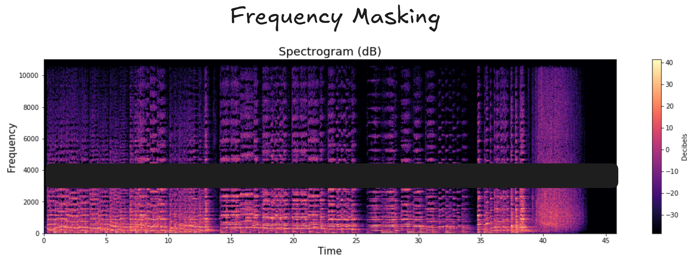
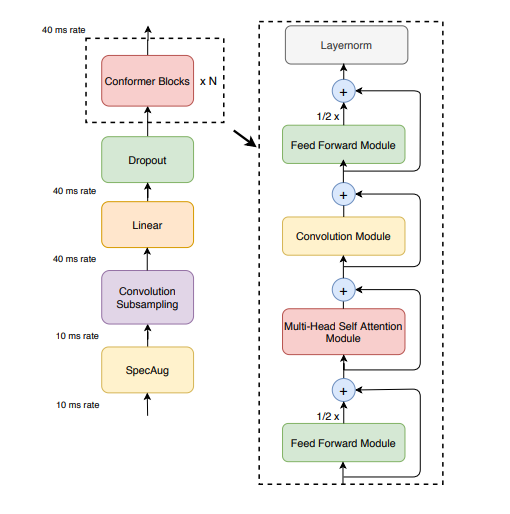
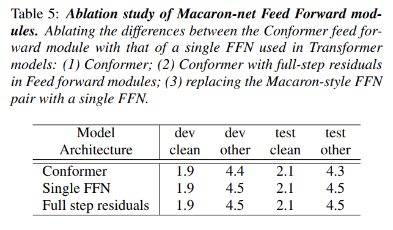
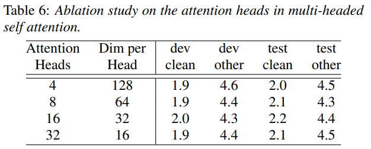

+++
title = 'Conformer'
date = 2026-05-05T19:46:28Z
draft = false
+++

Conformer architeture is one of the most popular known architecture in ASR system or in audio encoding. It is made up of two words - Convolution and Transformers. Essentially it jointly leverages the benefits of Convolutions which helps local feature extraction and transformers helps in global feature (temporal) and then finally merges both feature infomration on tasks such as translation or transcription generation. 

The blog is organized in the following order:
1. Audio Data and processing
2. Architecture of Conformer
3. Loss Function and Metrics
4. Future Scope and usage


## Audio Data and processing

The data starts with audio files and their corresponding transcripts. One can refer to any format of storing among most popular is JSONL where row row has path to the audio file and the transcript and another key value pair. 

The data is processed through a series of stages to obtain high quality data. Some of the most important steps in the pipeline includes:

1. Length based filtering
    > In this step, we filter the audio based on the duration. Typically we take the audio range between 1 to 30 seconds audio. 
2. Resampling and channel merging.
    > Now the resampling is performed which typically converts the audio from different sample rate to 16000 Hz or 22050 Hz sample rate. Most of the model follows 16000 Hz.If you want to know more why 16000 Hz. Consider reading about Nyquist-Shannon Theorem.
    While audios are mostly mono channel, there can be audios with dual channel meaning having left and right channel. Merging of these two channel into monon is performed in channel merging.
3. Signal to Noise Ratio Filtering
    > Most of the audios comes from different areas having different types of noises like market noise, train, chattering of people in the background. To filter out high quality data we calculate the Signal to Noise Ratio which represents how much noise is there in the audio. Typicall it should be above 10-15dB. It is calculated using: 
      $$\text{SNR}_{\text{dB}} = 10 \log_{10} \left( \frac{P_{\text{signal}}}{P_{\text{noise}}} \right)$$

The above are the most important ones. But there are other stages as well in the pipeline which includes - Voice Activity Detection and silence trimming, Speaking Rate, Loudness Normalization or using an existing ASR model with threshold WER to filter out high quality audios.  

PS - Always suspect your data first when training the model. I once trained a model on training set having SNR in the range of 15-25 for 95% while my test set had SNR above 25 dB for above 80% of the data. And I spent hours if not days wondering what is happening.


Once we get the audio and the respective transcript. Now its turn to convert the audio data into something which is easier for the model to process and make it computationally efficient. 


### Basics of Audio and encoding
We know that audio is continuous data. To store the audio in digital form, we sample the data from its continuous representation. This sampling technique is uniform ie it samples the data point at regular interval. The rate at which we sample the data point from the continuous representation is called **sample rate**. Now for our audio, the sample rate is 16000 Hz, which means for every second of audio 1s we have 16000 data points. For a 10 second audio this becomes 160000 data points. 

Now for the model to train on the audio data, even a batch size of 32 audios of 30 seconds each sampled at 16000 will yield: 32 x 30 x 16000 = 1,53,60,000 data points. This is massive. \
Also it comes very difficult for the model to learn from these datapoints. Hence to make it easier for the model, we mimick how we human perceive the audio.  \
For human we process audio logarithmly and not linearly. That we can easily distinguish the difference between audios being played at 10000Hz vs 11000 Hz as compared to audios being played at 10000 Hz vs 10100 Hz. This is where we leverage the Mel Spectrogram representation of audios essentially to do uplifting for the model to make its backprop journey a little simpler.  


### Mel Spectrogram

**Question** - Why do we consider mel spectrogram as input to the model? 

Using Mel Spectrogram as audio features brings two benefits: 

1. **Heavy uplifiting** - It does the initial heavy uplifiting of feature extraction and mimick how human perceive the audio. The segregates the single waveform of audio into different frequency band and timesteps. These frequency bands helps the model to understand which phoneme lies in which regions, hence making it easier for the model to learn.
2. **Tokenization** - Most of the Neural Network model accepts tokenized representation of data. 
    > Mel Spectrogram uses Framing and Windows for chunking the continuous wave into discrete features. 

    > Then it uses STFT to convert the discrete audio features into respective frequency bands (think of it like a prism, where audio comes as light and gets splitted into the different frequency bands like color). 

    > Then Mel Scale Warping is applied. Don't get terrified by the name. Just remember it as focusing on high density areas and highligting it more. It stretches the region where most of the human speech lives and squeezes the regions which are mostly silent and doesn't contain much information. 

    > Finally, we take the logarithm.

Now that we have our data ready, features processed to make the learning easier for the model. Let's see how we can use Augmentation technique to make the model more robust. 


<video controls autoplay loop muted width="800">
  <source src="../../static/assets/conformers/audiotomel.mp4" type="video/mp4">
</video>


### Spec Augmentation

Spectral Augmentation is a audio augmentation technique which is used to avoid overfitting in audio models and strengthen the robustness. It provides following benefits:
1. Avoids overfitting of model. Acts as regularizer inhibiting the model to memorize the data.
2. Bring robustness by masking time or frequency signifying missing information. Mimicks real world scnearios where audios segments can be missing or noisy.


We can apply Spec Augmentation by employing two major techniques: 
1. Time Masking: We mask the data along the time axis in the mel spectrogram.


2. Frequency Masking: We mask the data along the frequency axis of the mel spectrogram. 


Let's now dive into the architecture and see what role each layer/component plays.

## Architecture

Just like a normal transformer block conformer is made up of stacked: 



The conformer architecture has following components each play key role in audio feature extraction and processing.

- **i. Audio Processing**
    - a. Spec Aug
- **ii. Convolution Subsampling**
- **iii. Linear Layer**
- **iv. Conformer Blocks**
    - a. Feed Forward Layers
    - b. Multi-Head Self-Attention Module
    - c. Convolution Module
      - I. LayerNorm 
      - II. Pointwise Convolution
      - III. Gated Linear Unit
      - IV. Depthwise Convolution
      - V. BatchNorm
      - VI. Swish Activation
      - VII. Pointwise Convolution
      - VIII. Dropout
    - d. Feed Forward Layers
    - e. LayerNorm

The conformer blocks are repeated N times depending on the model size and model parameters. Lets see how each component of the architecture plays a role in the overall audio processing. 


### Convolution Subsampling
The mel spectrogram consists of T time stamps and n mel bins. These time stamps can be in the range of 1000s. Such a high counts brings computations challenges for the model since attention mechanism when applied on these 1000 time steps scaled quadrically. 

Hence to reduce the computations, we performs convolutional subsampling which essentially means we are doing strided convolution operations on the input data. Strided here means we have stride value > 1. In other words, we move the convolution kernel bs a value higher than 1. In our implementation we have kept it to two. 

This is the implementation: 
```python 
    convolution_subsampling = nn.Sequential(
        nn.Conv2d(in_channels, out_channels, kernel_size=3, stride=2),
        nn.ReLU(),
        nn.Conv2d(out_channels, out_channels, kernel_size=3, stride=2),
        nn.ReLU(),
    )
```

By convolution formulat the output channels and data shape becomes: 

$$
\begin{aligned}
O_i &= \left[\frac{H_i + 2P_h - K_h}{S_h}\right] + 1 \\[8pt]

H_i &= \text{Input Height} = 3000 \\
P_h &= \text{Padding Size} = 0 \\
K_h &= \text{Kernel Size} = 3 \\
S_h &= \text{Stride} = 2 \\[12pt]

\textbf{After first layer:} \\
O_i &= \left[\frac{3000 - 3}{2}\right] + 1 \\
    &= 1499 \\[12pt]

\textbf{After second layer:} \\
O_i &= \left[\frac{1500 - 3}{2}\right] + 1 \\
    &= 749
\end{aligned}
$$

<video controls autoplay loop muted width="800">
  <source src="../../static/assets/conformers/subsampling.mp4" type="video/mp4">
</video>


Convolution subsampling is then following by a Linear layer to match the internal dimension of the conformer block. 

### Macaron Style Feed Forward Network
Macaron Style FFN has been taken from [Macaron-Net](https://arxiv.org/pdf/1906.02762). It proposed for using two half FFN layers sandwiching the Multi Head Attention layer and the Convolution Block. The authors have done ablations to verify the benefit of using Macaron style FFN as compared to vanilla. 




### MultiHead Self Attention
This is the other half reason of the name **Conformer**. As you might have guessed, the *former* has been taken from transformers whose key architecture component was MultiHead Self Attention. 

In ASR system, both local and global features becomes super important for final transcription. While the local temporal features are captured very well by the CNN layers. The global features extraction is handled by the MultiHead Self Attention. Now, I am not going to cover multi head self attention and how it helps in learning global context in details. There are plenty of great videos to understand Attention mechanism and its role. My favourite is by [3Blue1Blow](https://www.youtube.com/watch?v=eMlx5fFNoYc), you can check it out. 

The authors have done ablation studies to find out how the number of heads affects the model accuracy. Based on the findings, it is suggested to keep the attention heads upto 16, beyond that the accuracy starts dropping. 




### Convolution Block
Convolution Blocks Module are responsible for capturing the temporal and merging information across different channels (think of them as different frequencies). 

#### LayerNorm
Before passing the data to next set of layers in the convolution block, it is important to normalize the data. It helps in two ways - first it ensures better gradient flow and second it helps in faster converging.

Since our data is sequential now (time dependent) we can't simply use Batch Norm. Batch Norm is used mostly in computer vision task because the input data if fixed dimension and shape and normalization factors can be calculated across batch.
Whereas for data like audios or text, the data is sequential and varies. Hence different batch will have different sequence steps which will affect the normalized values. Hence we take a different approach LayerNorm. 

Layernorm applies normalization across each time step across channels. In other words, LayerNorm is applied per token across its hidden features (embeddings dim). Hence we calculate the mean and variance per token. 

The following image will make it more clear:


)](https://www.pinecone.io/_next/image/?url=https%3A%2F%2Fcdn.sanity.io%2Fimages%2Fvr8gru94%2Fproduction%2F567b2a2d454f2da286ce3cbbe6ce4583a1e2417f-800x627.png&w=1920&q=75)

#### Pointwise Conv
Once we get the normalized features, the features goes through the pointwise convolution. Pointwise convolution, as you can guess by its name. Looks at each feature independently. It merges the information across channels (or think it as frequency band) into a single output per timestep. 

This usually helps in mixing information across different frequency band since the phoneme (smallest sound unit) or syllable (group of phonemes) might occur at a higher or lower frequency band. Pointwise merge that distributed information across the channel into a single representation. 

Additionally, since we are merging across channels and not considering local or adjacent features. The kernel in pointwise convolution is of shape (1x1). Also the number of output channels can be any number. It represents that those many different kernels are involved for feature extraction. Below is an example for Pointwise convolution. 

```python
pointwise_conv = nn.Conv2d(
    in_channels=in_channels,
    out_channels=num_of_output_filters,
    kernel_size=1
)
```

<video controls autoplay loop muted width="800">
  <source src="../../static/assets/conformers/pointwise_conv.mp4" type="video/mp4">
</video>


#### Gated Linear Unit Activation
Gated Linear Unit activation helps in filtering important features. It acts like a gating mechanism for the input data. Think of it like a filter which will allow only features with actual speaking content and discards all the noise or silence in the model.

How does it work? It relies on sigmoid function that acts as gating. The input is splitted evenly into two parts. Let's call them A and B matrice. To calculate GLU(X), we employ:

$$ 
\text{A} \rightarrow \text{A, B} \\
\text{GLU(X)} = \text{A} \otimes \text{sigmoid(B)}
$$


#### Depthwise Conv
We now pass these features to depthwise conv. As the name represent the depthwise conv are convolution kernel which merge features across temporal/spatial only. This means that each channel will have its own kernel and total number of output channel will remain the same. (Though we can have multiple filter per channel but usually we keep one filter per channel)

Think of it like you are focusing on different frequency spectrum and you got your across frequency band features, now you are merging features along timesteps. Depthwise Convolution imposes an inductive bias - "features should evolve independently locally", essentially it focuses on local structural pattern extraction. 

Below is an implementation of Depthwise convolution, notice that the number of output channels is the same as the input channels. The kernel size is taken to be as 31 as mentioned in the original paper.

```python
depthwise_conv = nn.Conv2d(
    in_channels=in_channels,
    out_channels=out_channels=in_channels,
    kernel_size=31,

)
```
<video controls autoplay loop muted width="800">
  <source src="../../static/assets/conformers/depthwise_conv.mp4" type="video/mp4">
</video>


#### BatchNorm
**Question - Why batchnorm now and not earlier? What changed now?**
We will come to this question in a while but first we need to understand what exactly Batch Norm does. 
BatchNorm applies the normalization per channel across batch and timestep. 

)](https://www.pinecone.io/_next/image/?url=https%3A%2F%2Fcdn.sanity.io%2Fimages%2Fvr8gru94%2Fproduction%2F409b7645d3bdc19d267f6a6bea3bbf75f70636f7-800x535.png&w=1920&q=75)


Mathematically, 

$$
\begin{aligned}

X &\in \mathbb{R}^{B \times T \times C} \\
\text{shape}(X) &= (32,\ 100,\ 256)

\end{aligned}
$$

BatchNorm computes statistics independently for each channel \(c\)
across the batch and time dimensions.

$$
\begin{aligned}

\mu_c
&=
\frac{1}{B \cdot T}
\sum_{b,t} x_{b,t,c}
\\[10pt]

\sigma_c^2
&=
\frac{1}{B \cdot T}
\sum_{b,t}
\left(x_{b,t,c} - \mu_c\right)^2
\\[10pt]

\hat{x}_{b,t,c}
&=
\frac{x_{b,t,c} - \mu_c}
{\sqrt{\sigma_c^2 + \epsilon}}

\end{aligned}
$$

Finally, BatchNorm applies learnable scale and bias:

$$
y_{b,t,c} = \gamma_c \hat{x}_{b,t,c} + \beta_c
$$

So if we have 256 channels we will have 256 mean and variance that will be applied across the batch 32 and timestep 100. 

Now, from the previous depthwise module we received features that has been processed for local features extraction (just like a CNN) each channel is processed independently by a depthwise convolution kernel. This makes the output resemble CNN-style feature maps, where different channels may represent different acoustic patterns such as transitions, harmonics, or local temporal structures. 

Batch Normalization is therefore applied because it works particularly well for convolutional feature maps. For each channel, BatchNorm computes statistics across the batch and time dimensions to stabilize the activation distribution of that feature detector. This helps maintain consistent feature scales and improves optimization stability during training.


#### Swish Activation
**Question - Why Swish activation now and now earlier?**
The GLU was used just before the depthwise convolution layers. This was done to ensure that only important acoustic feature are passed to next set of layer. The GLU acted as a gating mechanism which essentially worked to filter out all the noise and non-verbal audio features and pass it to the next layer. 

After passing through the depthwise features, we employ swish for non-linearity. While there are multiple benefits of using Swish over other activation function, one of the benefit of using swish over other activation function is that it acts as a self gating activation. It decides how much information needs to be passed to the next layer. In the formula below, the sigmoid gives a value between 0 to 1 and x is the features coming from previous layer. The sigmoid value controls the information flow to the next layer while also preserving small feature values. 


$$

\text{Swish(x)} = x . \sigma(x)

$$


#### PointWise convolution
As the features reach the final layer, we again employ pointwise convolution to merge the features channels and reduce the dimensionality of features to be passed on. 


#### Dropout
Dropout acts as a regularizer which helps in avoiding overfitting of the model. 


<!-- ### Convolution Block
We covereted convolution block in great details above. The output features from self attention are passed to the convolution block for local features extractions and filtering. -->


### Feed Forward Network
Lastly the layers are joined by the other half of the Macaron-style FFN layer completing the sandwich. 

So, the sandwich looks like:

$$
\begin{aligned}
x_1 &= x + \frac{1}{2} \cdot \mathrm{FFN}(x) \\
\\
x_2 &= x_1 + \mathrm{MHSA}(x_1) \\
\\
x_3 &= x_2 + \mathrm{ConvModule}(x_2) \\
\\
y &= x_3 + \frac{1}{2} \cdot \mathrm{FFN}(x_3)
\end{aligned}
$$

### LayerNorm
Finally, the output is normalized again to be fed again to the encoder.


## Loss Function and Metric

So till now, data processing and model architecturing has been done. Now we come to another challenging aspects which makes ASR problem very different from the other problems. This where we explore a new type of loss function called **Connectionist Temporal Classfication or (CTC)**. 


### Connectionist Temporal Classification
Connectionist 

First, why do we need CTC loss? Why can't we use the popular loss function such as Mean Squared Error or Cross Entropy. \
The challenge with ASR model is that it accepts a longer sequence (mel spectrogram) as input and converts it to a shorter sequence output (transcript).

Now most of the popular loss function expects you to match the shape and dimension between the inputs and the targets. As a result we can't use them in ASR system. This is where we use CTC to help the define a quantitative loss value for different length input and targets. 

**How does it work?** 

If you read the official documentation of [CTC Pytorch](https://docs.pytorch.org/docs/2.12/generated/torch.nn.CTCLoss.html)
>  Calculates loss between a continuous (unsegmented) time series and a target sequence. CTCLoss sums over the probability of possible alignments of input to target, producing a loss value which is differentiable with respect to each input node. The alignment of input to target is assumed to be “many-to-one”, which limits the length of the target sequence such that it must be ≤ the input length.

Notice that is is fundamentally calling the problem many to one. In simpler terms, lets say we have two different speaker speaking same text might have different input features to transcript mapping. Consider these two audios.

#### Speaker 1 
<audio controls>
  <source src="../../static/assets/conformers/sample1.wav" type="audio/mpeg">
</audio>


#### Speaker 2

<audio controls>
  <source src="../../static/assets/conformers/sample2.wav" type="audio/mpeg">
</audio>

<br>

Notice both of them are speaking the same content "Morning", but the speaker2 is speaking faster than speaker1. Now even though the audio length is almost the same for both, the features will be different. If the output features shape is 1, 16, 80 where 16 is timesteps and 80 is dimension (only for reference, actual dimension are relatively larger). The challenge becomes how to map the features to the text. There can be too many possibilities. Consider the representation below: 

| X1 | X2 | X3 | X4 | X5 | X6 | X7 | X8 | X9 | X10 | X11 | X12 | X13 | X14 | X15 | X16 |
| -- | -- | -- | -- | -- | -- | -- | -- | -- | --- | --- | --- | --- | --- | --- | --- |
| m  | m  | m  | o  | o  | r  | r  | n  | n  | i   | i   | n   | g   | -   | -   | -   |
| m  | -  | m  | o  | o  | o  | r  | n  | n  | i   | n   | g   | -   | -   | -   | -   |
| m  | m  | o  | o  | r  | r  | r  | n  | i  | i   | n   | g   | -   | -   | -   | -   |
| m  | m  | m  | o  | r  | r  | n  | n  | n  | i   | i   | n   | g   | -   | -   | -   |
| m  | -  | o  | o  | o  | r  | n  | n  | i  | i   | i   | n   | g   | -   | -   | -   |
| m  | m  | m  | m  | o  | r  | r  | n  | i  | n   | n   | g   | -   | -   | -   | -   |
| m  | m  | o  | r  | r  | r  | n  | n  | i  | i   | n   | n   | g   | -   | -   | -   |
| m  | -  | m  | m  | o  | r  | n  | n  | n  | i   | i   | n   | g   | -   | -   | -   |
| m  | m  | m  | o  | o  | r  | n  | i  | i  | i   | n   | n   | g   | -   | -   | -   |
| m  | m  | o  | o  | o  | r  | r  | n  | n  | i   | n   | g   | -   | -   | -   | -   |
| m  | m  | m  | o  | r  | n  | n  | n  | i  | i   | n   | n   | g   | -   | -   | -   |
| m  | -  | m  | o  | o  | r  | r  | r  | n  | i   | i   | n   | g   | -   | -   | -   |
| m  | m  | o  | o  | r  | n  | n  | i  | i  | n   | n   | n   | g   | -   | -   | -   |
| m  | m  | m  | o  | o  | o  | r  | r  | n  | i   | i   | n   | g   | -   | -   | -   |
| m  | -  | m  | o  | r  | r  | n  | n  | i  | i   | i   | n   | g   | -   | -   | -   |

The final transcript is generated by taking unique consecutive tokens (mmmoorrrniingg__ -> morning). But as you can see the possibilities of feature mapping to correct target can be too many. So then how does CTC solve it? 

Mathematically, 

$$
P(y \mid x)
=
\sum_{\text{all valid alignments } \pi \text{ for } y}
\prod_{t=1}^{T}
P(\pi_t \mid x)
$$


It basically gives us a single quantitative probability of y(transcript) given x (input audio). So that we don't have to consider too many possibilities. CTC consider all the different alignment probability and takes a sum of it (the outer summation). To calculate the probability, it uses chain of rule where it takes a product of the probability for token at each timestep. This gives the final probability. 

Now there are other challenges:
1. Computation Challenges: Maintaining and calculating the product and probability at each step is too much computationally challenging. 
> CTC uses Dynamic Programming to reuse the previously calculated value to same complexity.
2. What about the repeated token? It will collapse all the same tokens into one token (sspeeechhh -> spech).
> A special token is introduced $\epsilon$ that segregates repeating token and also represents blank token (sss p $\epsilon$   ee $\epsilon$ e $\epsilon$  ch -> speech)

Finally to convert the probability into loss, we use log likelihood. 

$$
\mathcal{L}_{CTC}
=
-\log P(y \mid x)
$$

$$
=
-
\log
\left(
\sum_{\text{all valid alignments } \pi \text{ for } y}
\prod_{t=1}^{T}
P(\pi_t \mid x)
\right)
$$


### Evaluation Metrics
Now once we have trained the models. We use metrics like Word Error Rate or Character Error Rate to score the accuracy of the ASR model. Though there have been a lot of speculations on the inefficiency of these metrics as mentioned in the blogs by [speechmatics](https://www.speechmatics.com/company/articles-and-news/the-problem-with-word-error-rate-wer) or by [assembly](https://www.assemblyai.com/blog/new-word-error-rate-wer-benchmark). But despite the issues, they act as a good starting evaluation metrics for the ASR system. 

#### Word Error Rate
As the name represents, we essentially calculate the number of words errors between the target transcript and the generated transcript. The score is represented in percentage (0-100). The lower the value, the better the ASR model is. To calculate the WER, we use following formula:

$$
WER
=
\frac{S + D + I}{N}
$$

    S = number of substitutions
    D = number of deletions
    I = number of insertions
    N = total number of words in the reference transcript

Basically we see how much changes we have to do in terms of (insertion, deletion or substitution) to convert the predicted transcript to targeted transcript. Consider the example below: 

<div style="font-family: Arial, sans-serif; max-width: 600px; margin: 0 auto;">

<!-- ALIGNMENT TABLE -->
<table style="width: 100%; border-collapse: collapse; text-align: center; border: 1px solid #111827;">
  <tr style="background: #111827; color: white;">
    <th style="padding: 12px; border: 1px solid #374151;">Reference (N=4)</th>
    <th style="padding: 12px; border: 1px solid #374151;">Prediction</th>
    <th style="padding: 12px; border: 1px solid #374151;">Error Type</th>
  </tr>

  <!-- CORRECT -->
  <tr style="background: #dcfce7; color: #166534;">
    <td style="padding: 14px; border: 1px solid #bbf7d0; font-weight: 600;">the</td>
    <td style="padding: 14px; border: 1px solid #bbf7d0; font-weight: 600;">the</td>
    <td style="padding: 14px; border: 1px solid #bbf7d0; font-weight: 700;">✓ Correct</td>
  </tr>

  <!-- SUBSTITUTION -->
  <tr style="background: #ffedd5; color: #9a3412;">
    <td style="padding: 14px; border: 1px solid #fed7aa; font-weight: 600;">quick</td>
    <td style="padding: 14px; border: 1px solid #fed7aa; font-weight: 600;">fast</td>
    <td style="padding: 14px; border: 1px solid #fed7aa; font-weight: 700;">⟷ Substitution (S)</td>
  </tr>

  <!-- CORRECT -->
  <tr style="background: #dcfce7; color: #166534;">
    <td style="padding: 14px; border: 1px solid #bbf7d0; font-weight: 600;">brown</td>
    <td style="padding: 14px; border: 1px solid #bbf7d0; font-weight: 600;">brown</td>
    <td style="padding: 14px; border: 1px solid #bbf7d0; font-weight: 700;">✓ Correct</td>
  </tr>

  <!-- DELETION -->
  <tr style="background: #fee2e2; color: #991b1b;">
    <td style="padding: 14px; border: 1px solid #fecaca; font-weight: 600;">fox</td>
    <td style="padding: 14px; border: 1px solid #fecaca; font-weight: 600;">—</td>
    <td style="padding: 14px; border: 1px solid #fecaca; font-weight: 700;">− Deletion (D)</td>
  </tr>

  <!-- INSERTION -->
  <tr style="background: #e0e7ff; color: #3730a3;">
    <td style="padding: 14px; border: 1px solid #c7d2fe; font-weight: 600;">—</td>
    <td style="padding: 14px; border: 1px solid #c7d2fe; font-weight: 600;">jumps</td>
    <td style="padding: 14px; border: 1px solid #c7d2fe; font-weight: 700;">＋ Insertion (I)</td>
  </tr>
</table>

</div>

<br>

$$
\text{WER} = \frac{(S + D + I)}{N}
\\[12pt]
\text{WER} = \frac{1 + 1 + 1}{4} = 0.75 = 75\%
$$


#### Character Error Rate
CER is same as WER but instead of calculating the errors on words, it calculates it on tokens. 
$$
CER
=
\frac{S + D + I}{N}
$$

## Future Scope and usage
1. [FastConformer](https://arxiv.org/abs/2305.05084) - Fastconformer was introduced by Nvidia which was a faster variant of conformer giving inference at ~2x better performance. They did aggressive subsampling and also changed the Attention with Longformer style sparse attention. 
2. Lot of current autoregressive models use FastConformer as Audio encoder and pretrained LLM as decoder. Examples - Nvidia Canary, Parakeet. 


## References
1. [Conformer Paper]()
2. [Pytorch CTC Documentation](https://docs.pytorch.org/docs/2.12/generated/torch.nn.CTCLoss.html)
3. [Blog on CTC by Distill.pub](https://distill.pub/2017/ctc/)
4. [CTC Loss by Priyam](https://www.youtube.com/watch?v=qvTDRUDDK30)
5. [HF Space for Audio Generation](https://huggingface.co/spaces/hexgrad/Kokoro-TTS)